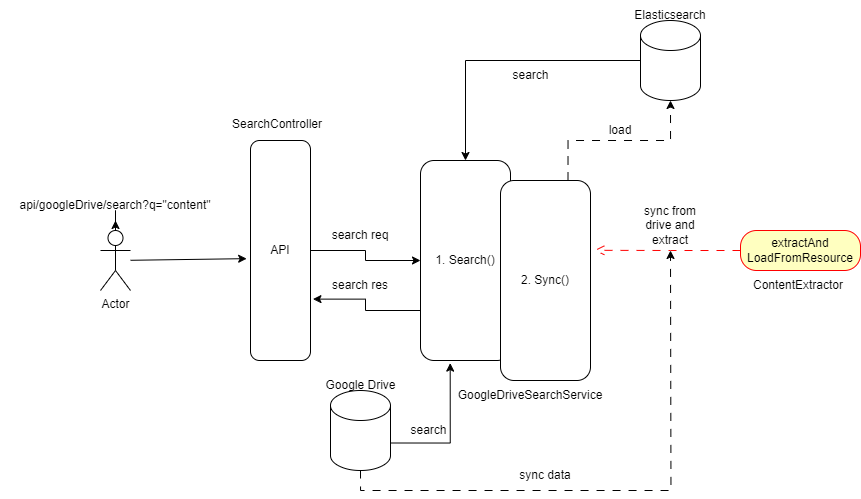

# Document Search Application
Design and build an application that can search documents from a cloud storage service like Dropbox or Google Drive on the content inside the document.

## Problem Statement

Develop an application that searches documents from a cloud storage service like (Google Drive, Dropbox, etc.) based on the content inside the document.

## Requirements

### Connectivity to Online Storage (Google Storage):

- Connect storage service using Google Drive APIs.
- Fetch and retrieve files using the Drive service's APIs.

### Supported File Formats:

- Support .csv, .txt, .pdf, or .docx files.
- Extract text content from files using (Apache Tika)

### Indexing:

- Index file content for text search capabilities.
- Choose Elasticsearch for indexing

### API for Search:

- Provide an API that takes a search term/token as input. (Spring Boot Rest API)
- Returns a list of files and their HTTP URLs

### User Interface:

- Consumes the search API and displays files matching the query.

## Implementation Plan

### Connectivity Module:

- Implement a module to connect Google Drive storage (`GoogleDriveClient.class`)

### File Fetching:

- Fetch files using the Drive service's APIs. (`GoogleDriveClient#listFiles`)

### Content Extraction:

- `ContentExtractor` uses Apache Tika to extract text content.

### Indexing Module:

- `ElasticSearchConsumer` implements a suitable storage solution for indexing features like (building index requests, saving indexes, read data).

### Search API:

- `SearchController` handles search requests.

### User Interface Module:

- Postman Get Method call: `http://localhost:8080/api/googleDrive/search?q="e"`

### Sync Job:

- The `GoogleDriveSearchService` initiates a synchronization job offline, extracting data using the `ContentExtractor` from Google Drive files and indexing it into Elasticsearch.
- Users can invoke a content-based search query and obtain results.
- In the background, when a user initiates a search, the system initially retrieves content and metadata from Elasticsearch, followed by the `GoogleDriveClient` listing the necessary files.

